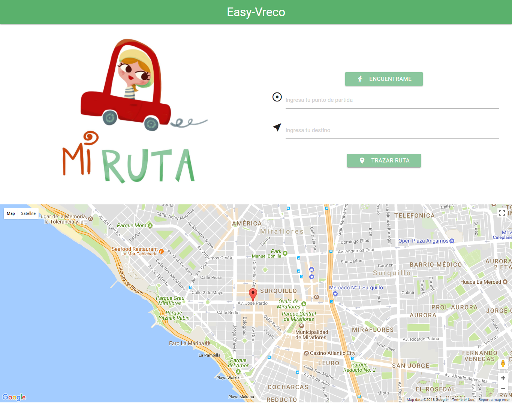
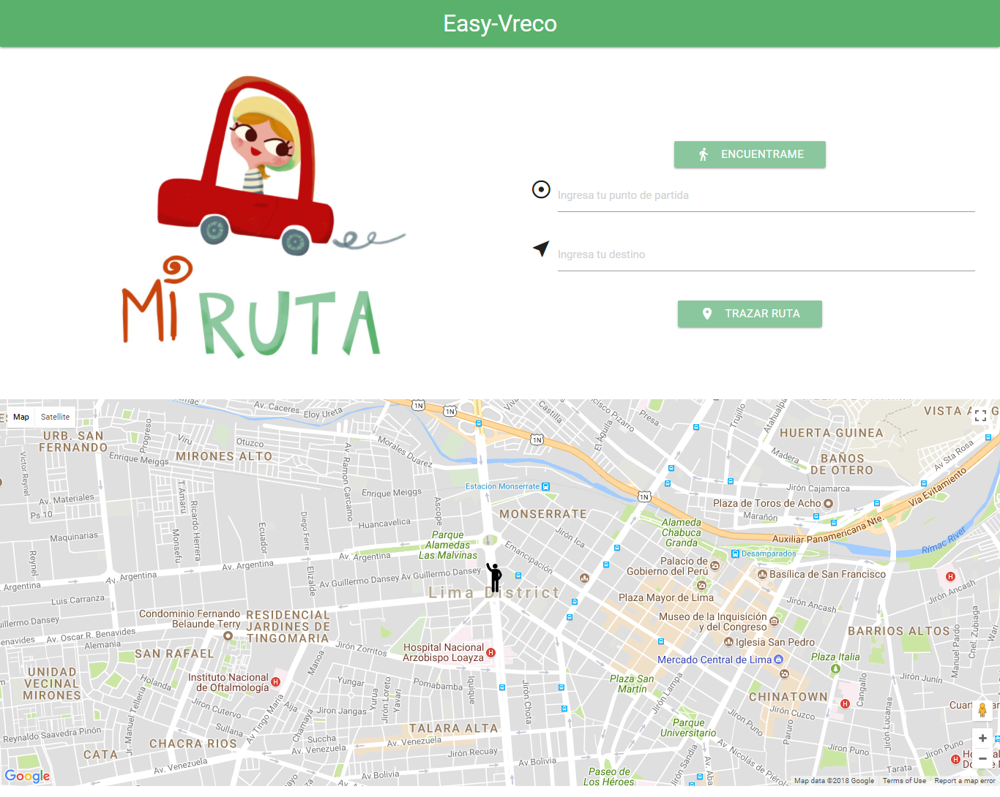
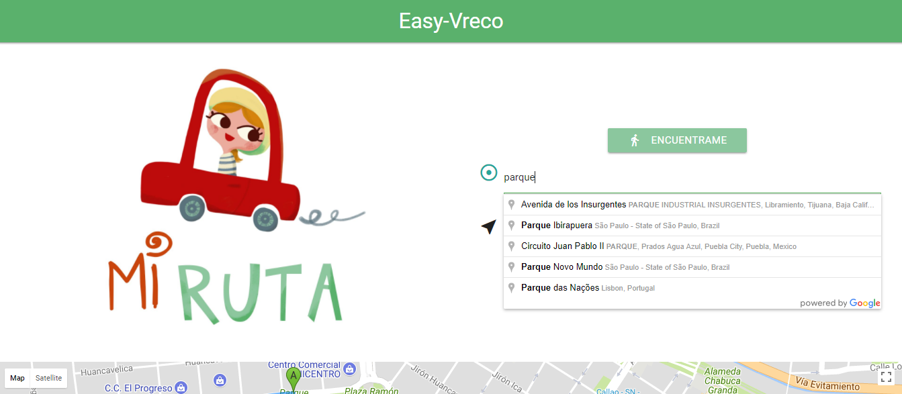
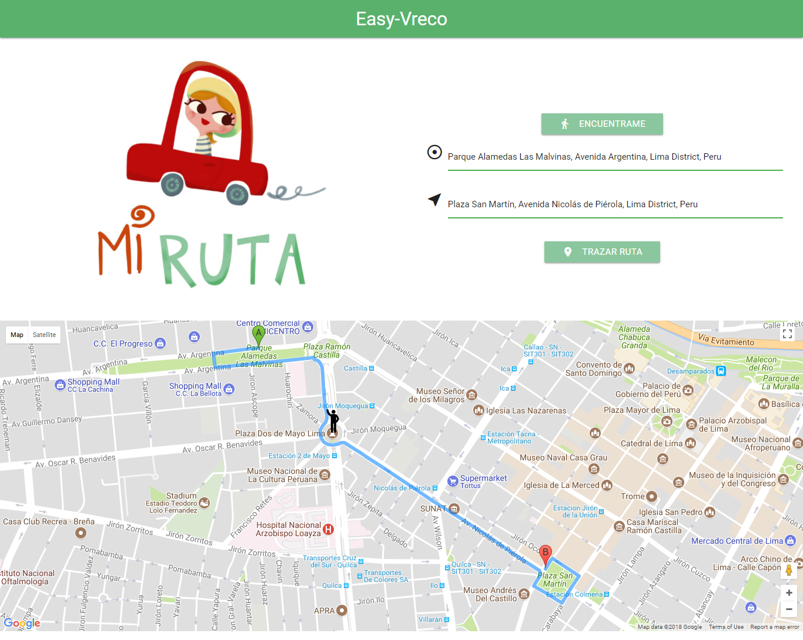

# Easy Vreco

**Easy Vreco** es el ejercicio desarrollado sobre API Geolocalización y API Google Maps.

***
## Plan de trabajo

#### 1.Planificación

1. Se investigó el tema a tratar API Geolocalización y API Google Maps.

2. Se dividio las funcionalidades de Encuentrame, Autocompletado y trazar ruta.

3. Se maquetó el demo.

.

4. Se desarrollo las funcionalidades

5. Elaboración del README.

#### 2. Recursos

##### 2.1. API Geolocalización

Permite al usuario compartir su ubicación a las aplicaciones web si así lo desea.

##### 2.1. API Google Maps

Permite crear aplicaciones para la Web y para dispositivos móviles que pueden personalizarse con imágenes satelitales, mapas de Street View y mapas interactivos.

##### 2.2. Visual Studio Code

Editor de código fuente.

##### 2.3. Jquery

Librería de JavaScript de código abierto que permite agregar interactividad y efectos visuales.

##### 2.4. Materialize

 Framework que permite facilitar el desarrollo.

##### 2.5. Google Fonts

Directorio interactivo que permite añadir tipografias a la web.

#### 3. Desarrollo de la librería

* Estructura semántica de HTML5
* Maquetado
* Implementación de la funcionalidad esencial.

  * Inicilizar el mapa
    * Objetivos:
      * Definir una constante de latitud y longitud.
      * Definir el autocompletado de los inputs.
      * Definir la ruta a trazar.
 * Definir la funcionalidad de Encuentrame según mi ubicación actual
    * Objetivos:
      * Definir una constante de latitud y longitud.
      * Definir el autocompletado de los inputs.
      * Definir la ruta a trazar.
  ***
## Funcionamiento...!!!

1. Click en el botón `Encuentrame`.
2. Ingresar el punto de partida.
3. Ingresar el destino.
4. Click en el botón `Trazar ruta`.

### ENCUENTRAME

.
***
### ENCUENTRAME HACKER EDITION

.
***
### EASY-VRECO
.
***

## Funcionalidad
.
#### Desktop
.
***
#### Mobile

## Colaboradores

* Silvia Fuentes
* Eleyne Ramírez
